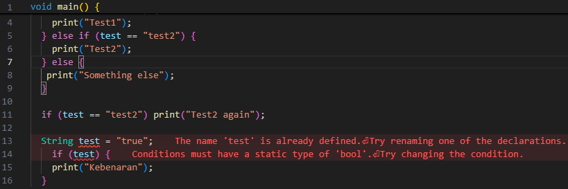
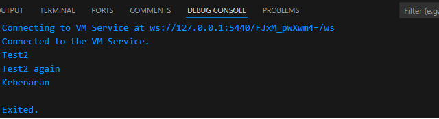
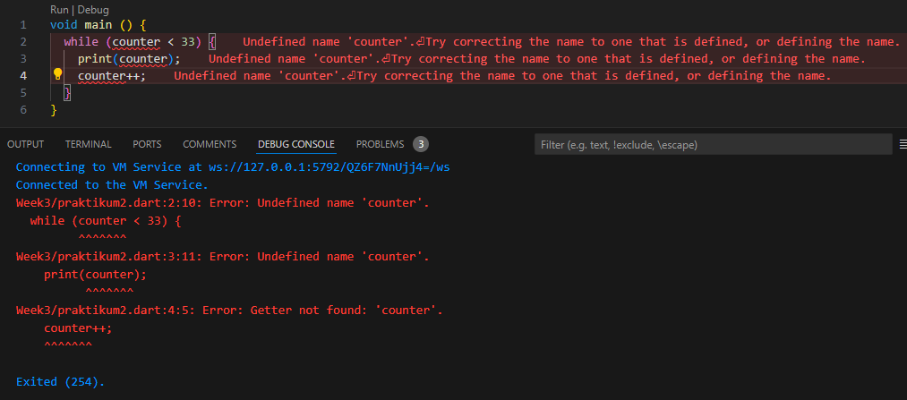
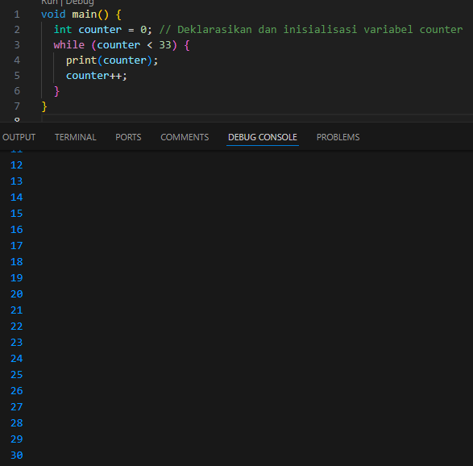
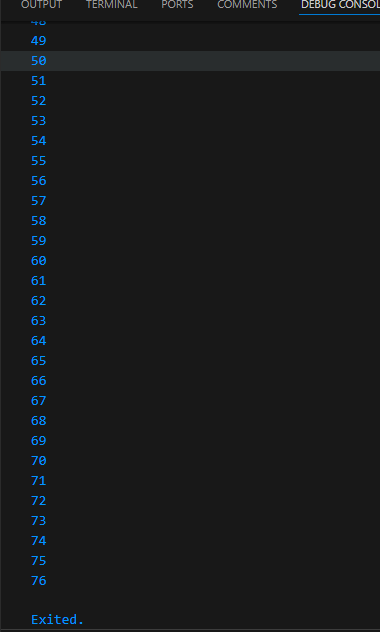
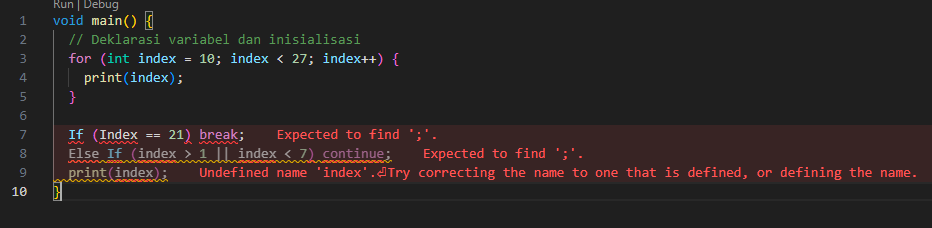

# Tugas Praktikum
---

1. Selesaikan Praktikum 1 sampai 3, lalu dokumentasikan berupa screenshot hasil pekerjaan beserta penjelasannya!
2. Buatlah sebuah program yang dapat menampilkan bilangan prima dari angka 0 sampai 201 menggunakan Dart. Ketika bilangan prima ditemukan, maka tampilkan nama lengkap dan NIM Anda.
3. Kumpulkan berupa link commit repo GitHub pada tautan yang telah disediakan di grup Telegram!

## Praktikum 1: Menerapkan Control Flows ("if/else")

### Langkah 1:
Ketik atau salin kode program berikut ke dalam fungsi `main()`:

```dart
void main() {
  String test = "test2";
  if (test == "test1") {
    print("Test1");
  } else if (test == "test2") {
    print("Test2");
  } else {
    print("Something else");
  }

  if (test == "test2") print("Test2 again");
}
```

### Langkah 2:
Silakan eksekusi (Run) kode pada langkah 1 tersebut. Apa yang terjadi? Jelaskan!
img src="run1.png"

**Penjelasan:**
Saat menjalankan kode, variabel `test` diatur ke `"test2"`. Dalam blok `if-else`, kondisi `test == "test1"` tidak terpenuhi, tetapi kondisi `test == "test2"` terpenuhi, sehingga mencetak `"Test2"`. Setelah itu, blok `if` kedua juga memeriksa apakah `test == "test2"` dan, karena kondisi tersebut benar, mencetak `"Test2 again"`.

### Langkah 3:
Tambahkan kode program berikut, lalu coba eksekusi (Run) kode Anda.

**Kode Tambahan:**
```dart
String test = "true";
if (test) {
  print("Kebenaran");
}
```

**Apa yang terjadi? Jika terjadi error, silakan perbaiki namun tetap menggunakan `if/else`.**


**Penjelasan:**
Terjadi error karena `test` dideklarasikan dua kali dan juga karena kondisi `if` tidak valid untuk tipe `String`. Perbaikan kode adalah dengan menggunakan nama variabel yang berbeda dan memastikan tipe kondisi `if` adalah boolean.

**Perbaikan Kode:**
```dart
void main() {
  String test = "test2";
  if (test == "test1") {
    print("Test1");
  } else if (test == "test2") {
    print("Test2");
  } else {
    print("Something else");
  }

  if (test == "test2") print("Test2 again");

  // Menggunakan nama variabel yang berbeda dan tipe boolean
  bool isTrue = true;
  if (isTrue) {
    print("Kebenaran");
  }
}
```
hasil run :


## Praktikum 2: Menerapkan Perulangan "while" dan "do-while"

### Langkah 1:
Ketik atau salin kode program berikut ke dalam fungsi `main()`:

```dart
void main() {
  while (counter < 33) {
    print(counter);
    counter++;
  }
}
```


**Penjelasan:**
Terjadi error karena variabel `counter` tidak dideklarasikan. Sebelum menggunakan `counter` dalam loop `while`, Anda perlu mendeklarasikan dan menginisialisasinya terlebih dahulu.

**Perbaikan Kode:**
```dart
void main() {
  int counter = 0; // Deklarasikan dan inisialisasi variabel counter
  while (counter < 33) {
    print(counter);
    counter++;
  }
}
```


**Penjelasan Hasil Kode yang Diperbaiki:**
Variabel `counter` diinisialisasi dengan nilai `0`. Kode yang diperbaiki akan mencetak angka dari `0` hingga `32`, satu per satu.

### Langkah 2:
Silakan eksekusi (Run) kode pada langkah 1 tersebut. Apa yang terjadi? Jelaskan! Lalu perbaiki jika terjadi error.
```dart
void main() {
    int counter = 0; // Deklarasikan dan inisialisasi variabel counter
    while (counter < 33) {
        print(counter);
        counter++;
    }
}
```
**Penjelasan:**
Saat kode diperbaiki dan dijalankan, Anda akan melihat output angka dari `0` hingga `32`. Pastikan `counter` dideklarasikan dengan benar dan tidak terjadi error.

### Langkah 3:
Tambahkan kode program berikut, lalu coba eksekusi (Run) kode Anda.

**Kode Tambahan:**
```dart
do {
  print(counter);
  counter++;
} while (counter < 33);
```

**Apa yang terjadi? Jika terjadi error, silakan perbaiki namun tetap menggunakan `do-while`.**


**Penjelasan:**
Kode `do-while` memastikan bahwa blok kode dijalankan setidaknya satu kali sebelum memeriksa kondisi. Hasilnya adalah mencetak angka dari `0` hingga `76`, sama seperti dengan `while`.

## Praktikum 3: Menerapkan Perulangan "for" dan "break-continue"

### Langkah 1:
Ketik atau salin kode program berikut ke dalam fungsi `main()`:

```dart
for (Index = 10; index < 27; index) {
  print(Index);
}
```

### Langkah 2:
Silakan eksekusi (Run) kode pada langkah 1 tersebut. Apa yang terjadi? Jelaskan! Lalu perbaiki jika terjadi error.
img src="error3.png"

**Penjelasan:**
Terjadi error karena variabel tidak dideklarasikan. Dalam bagian iterasi for loop, index seharusnya ditingkatkan dengan index++ atau index += 1. Saat ini, tidak ada penambahan variabel index, jadi loop akan menjadi loop tak berujung (infinite loop) karena index tidak pernah berubah.

**Perbaikan kode**
```dart
void main() {
    // Deklarasi variabel dan inisialisasi
    for (int index = 10; index < 27; index++) {
        print(index);
    }
}
```


### Langkah 3:
Tambahkan kode program berikut di dalam `for-loop`, lalu coba eksekusi (Run) kode Anda.

**Kode Tambahan:**
```dart
If (Index == 21) break;
Else If (index > 1 || index < 7) continue;
print(index);
```

**Apa yang terjadi? Jika terjadi error, silakan perbaiki namun tetap menggunakan `for` dan `break-continue`.**


**Penjelasan:**
Terjadi error karena di Dart, penggunaan if dan else if harus ditulis dengan huruf kecil, yaitu if dan else if. Selain itu, break dan continue hanya valid di dalam loop; mereka tidak dapat digunakan di luar loop. Dalam kode diatas break dan continue diletakkan di luar loop, yang menyebabkan kesalahan. Juga, variabel Index yang digunakan di luar loop harus konsisten dengan deklarasi variabel di dalam loop, yang menggunakan huruf kecil index.

**Perbaikan kode**
```dart
void main() {
  // Deklarasi variabel dan inisialisasi
  for (int index = 10; index < 27; index++) {
    print(index);

    // Penggunaan if, break, dan continue di dalam loop
    if (index == 21) {
      break; // Keluar dari loop jika index sama dengan 21
    }
    if (index > 1 || index < 7) {
      continue; // Lewati iterasi jika index lebih besar dari 1 atau kurang dari 7
    }
    print(index);
  }
}
```