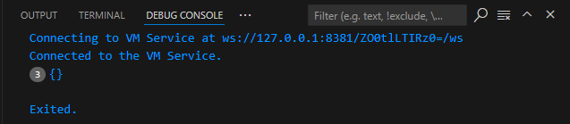
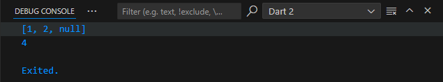

# Praktikum 1: Eksperimen Tipe Data List
Selesaikan langkah-langkah praktikum berikut ini menggunakan VS Code atau Code Editor favorit Anda.

## Langkah 1:
Ketik atau salin kode program berikut ke dalam void main().

```dart
void main() {
    var list = [1, 2, 3];
    assert(list.length == 3);
    assert(list[1] == 2);
    print(list.length);
    print(list[1]);

    list[1] = 1;
    assert(list[1] == 1);
    print(list[1]);
}
```

## Langkah 2:
Silakan coba eksekusi (Run) kode pada langkah 1 tersebut. Apa yang terjadi? Jelaskan!


Penjelasan : 
Hasil eksekusi dari kode program di atas menunjukkan bahwa `list.length` menampilkan panjang list sebesar 3. Elemen kedua dalam list, yang memiliki indeks 1, awalnya bernilai 2 dan berhasil diubah menjadi 1 pada baris terakhir. Fungsi `assert()` digunakan untuk memastikan kondisi tertentu benar, dan dalam kasus ini, tidak ada error yang dihasilkan karena semua kondisi yang diuji benar. Program berjalan sesuai harapan tanpa masalah.

## Langkah 3:
Ubah kode pada langkah 1 menjadi variabel final yang mempunyai index = 5 dengan default value = null. Isilah nama dan NIM Anda pada elemen index ke-1 dan ke-2. Lalu print dan capture hasilnya.

Apa yang terjadi ? Jika terjadi error, silakan perbaiki.

kode program yang diubah 
```dart
void main() {
  // var list = [1, 2, 3];
  // assert(list.length == 3);
  // assert(list[1] == 2);
  // print(list.length);
  // print(list[1]);

  // list[1] = 1;
  // assert(list[1] == 1);
  // print(list[1]);

  //labgkah 3
  final List list = List.filled(5, null); 
  list[1] = 'Nurhaliza Anindya Putri';   
  list[2] = '2241720016';   

  print(list);   

}
```

hasil running 


# Praktikum 2: Eksperimen Tipe Data Set
Selesaikan langkah-langkah praktikum berikut ini menggunakan VS Code atau Code Editor favorit Anda.

## Langkah 1
Ketik atau salin kode program berikut ke dalam void main().
```dart
void main() { 
  var halogens = {'fluorine', 'chlorine', 'bromine', 'iodine', 'astatine'};
  print(halogens);
}
```

## Langkah 2
Silakan coba eksekusi (Run) kode pada langkah 1 tersebut. Apa yang terjadi? Jelaskan!


Penjelasan:
Kode di atas membuat sebuah Set bernama halogens yang berisi lima elemen: 'fluorine', 'chlorine', 'bromine', 'iodine', dan 'astatine'. Ketika kode ini dieksekusi, hasilnya akan mencetak elemen-elemen tersebut dalam urutan yang tidak dijamin tetap, karena Set tidak mempertahankan urutan.

## Langkah 3
Tambahkan kode program berikut, lalu coba eksekusi (Run) kode Anda.

```dart
void main() { 
  var halogens = {'fluorine', 'chlorine', 'bromine', 'iodine', 'astatine'};
  print(halogens);

  var names1 = <String>{};
  Set<String> names2 = {}; // This works, too.
  var names3 = {}; // Creates a map, not a set.

  print(names1);
  print(names2);
  print(names3);
}
```
Apa yang terjadi ? Jika terjadi error, silakan perbaiki namun tetap menggunakan ketiga variabel tersebut. Tambahkan elemen nama dan NIM Anda pada kedua variabel Set tersebut dengan dua fungsi berbeda yaitu .add() dan .addAll(). Untuk variabel Map dihapus, nanti kita coba di praktikum selanjutnya.

Hasil running


Penjelsan:
`names1` adalah sebuah Set kosong yang dideklarasikan secara eksplisit dengan tipe `String`. Sementara itu, `names2` menggunakan cara lain untuk mendeklarasikan Set dengan tipe `String`, namun keduanya sama-sama Set kosong. Di sisi lain, `names3` secara otomatis dikenali sebagai Map kosong, bukan Set, karena dalam Dart, deklarasi menggunakan `{}` tanpa tipe yang jelas akan menghasilkan sebuah Map secara default. Untuk memperbaiki kode, kita tetap menggunakan `names1` dan `names2` sebagai Set, dan menghapus `names3` dari kode karena tidak sesuai dengan eksperimen yang fokus pada tipe data Set.

Perubahan kode program 
```dart
void main() { 
  // var halogens = {'fluorine', 'chlorine', 'bromine', 'iodine', 'astatine'};
  // print(halogens);

  var names1 = <String>{};
  Set<String> names2 = {}; // This works, too.
  // var names3 = {}; // Creates a map, not a set.

  // print(names1);
  // print(names2);
  // print(names3);

  names1.add('Nurhaliza Anindya Putri');  
  names1.add('2241720016');   
  
  names2.addAll({'Nurhaliza Anindya Putri', '2241720016'});

  print(names1);
  print(names2);
}
```

Hasil running 


# Praktikum 3: Eksperimen Tipe Data Maps

Selesaikan langkah-langkah praktikum berikut ini menggunakan VS Code atau Code Editor favorit Anda.

## Langkah 1:
Ketik atau salin kode program berikut ke dalam fungsi main().
```dart 
void main () {
  var gifts = {
    // Key:    Value
    'first': 'partridge',
    'second': 'turtledoves',
    'fifth': 1
  };

  var nobleGases = {
    2: 'helium',
    10: 'neon',
     18: 2,
  };

  print(gifts);
  print(nobleGases);
}
```

## Langkah 2:
Silakan coba eksekusi (Run) kode pada langkah 1 tersebut. Apa yang terjadi? Jelaskan! Lalu perbaiki jika terjadi error.


Penjelaasan:
Kode ini akan mencetak isi dari gifts dan nobleGases. Tidak ada error yang terjadi karena kedua Map dideklarasikan dengan benar dan elemen-elemen di dalamnya sesuai dengan tipe yang diizinkan.

## Langkah 3:
Tambahkan kode program berikut, lalu coba eksekusi (Run) kode Anda.
```dart
// ignore_for_file: unused_local_variable

void main () {
  var gifts = {
    // Key:    Value
    'first': 'partridge',
    'second': 'turtledoves',
    'fifth': 1
  };

  var nobleGases = {
    2: 'helium',
    10: 'neon',
     18: 2,
  };

  var mhs1 = Map<String, String>();
  gifts['first'] = 'partridge';
  gifts['second'] = 'turtledoves';
  gifts['fifth'] = 'golden rings';

  var mhs2 = Map<int, String>();
  nobleGases[2] = 'helium';
  nobleGases[10] = 'neon';
  nobleGases[18] = 'argon';

  print(gifts);
  print(nobleGases);
}
```
Apa yang terjadi ? Jika terjadi error, silakan perbaiki.


Penjelaasan:
Setelah penambahan elemen baru pada gifts dan nobleGases, outputnya akan menampilkan perubahan serta elemen nama dan NIM yang sudah ditambahkan.

Tambahkan elemen nama dan NIM Anda pada tiap variabel di atas (gifts, nobleGases, mhs1, dan mhs2). Dokumentasikan hasilnya dan buat laporannya!

Perubahan kode porgram
```dart
// ignore_for_file: unused_local_variable

void main () {
  var gifts = {
    // Key:    Value
    'first': 'partridge',
    'second': 'turtledoves',
    'fifth': 1
  };

  var nobleGases = {
    2: 'helium',
    10: 'neon',
     18: 2,
  };

  var mhs1 = Map<String, String>();
  gifts['first'] = 'partridge';
  gifts['second'] = 'turtledoves';
  gifts['fifth'] = 'golden rings';

  gifts['name'] = 'Nurhaliza Anindya Putri';
  gifts['nim'] = '2241720016';


  var mhs2 = Map<int, String>();
  nobleGases[2] = 'helium';
  nobleGases[10] = 'neon';
  nobleGases[18] = 'argon';

  nobleGases[20] = 'Nurhaliza Anindya Putri';
  nobleGases[30] = '2241720016';

  mhs1['name'] = 'Nurhaliza Anindya Putri';
  mhs1['nim'] = '2241720016';

  mhs2[1] = 'Nurhaliza Anindya Putri';
  mhs2[2] = '2241720016';


  print(gifts);
  print(nobleGases);
  print(mhs1);
  print(mhs2);
}
```

Hasil running program 


# Praktikum 4: Eksperimen Tipe Data List: Spread dan Control-flow Operators
Selesaikan langkah-langkah praktikum berikut ini menggunakan VS Code atau Code Editor favorit Anda.

## Langkah 1:
Ketik atau salin kode program berikut ke dalam fungsi main().
```dart
void main() {
  var list = [1, 2, 3];
  var list2 = [0, ...list];
  print(list1);
  print(list2);
  print(list2.length);
}
```

## Langkah 2:
Silakan coba eksekusi (Run) kode pada langkah 1 tersebut. Apa yang terjadi? Jelaskan! Lalu perbaiki jika terjadi error.


Penjelasan:
Variabel list1 tidak dideklarasikan. Program mencoba untuk mencetak variabel list1, tapi yang dideklarasikan hanya list. Akibatnya, terjadi error karena variabel yang dipanggil tidak ada.

pembenaran kode:
```dart
void main() {
  var list1 = [1, 2, 3];
  var list2 = [0, ...list1];
  print(list1);
  print(list2);
  print(list2.length);
}
```
Hasil running:


## Langkah 3:
Tambahkan kode program berikut, lalu coba eksekusi (Run) kode Anda.
```dart
void main() {
  var list1 = [1, 2, 3];
  var list2 = [0, ...list1];
  print(list1);
  print(list2);
  print(list2.length);

  list1 = [1, 2, null];
  print(list1);
  var list3 = [0, ...?list1];
  print(list3.length);
}
```

Apa yang terjadi ? Jika terjadi error, silakan perbaiki.


Penjelasan:
Terjadi error karena pada kode sebelumnya var list1 sudah di deklarasikan

Pembenar kode program:
```dart 
void main() {
  // var list1 = [1, 2, 3];
  // var list2 = [0, ...list1];
  // print(list1);
  // print(list2);
  // print(list2.length);

  var list1 = [1, 2, null];
  print(list1);
  var list3 = [0, ...?list1];
  print(list3.length);
}
```

hasil running


Tambahkan variabel list berisi NIM Anda menggunakan Spread Operators. Dokumentasikan hasilnya dan buat laporannya!
Tambahan kode program:
```dart
void main() {
  // var list1 = [1, 2, 3];
  // var list2 = [0, ...list1];
  // print(list1);
  // print(list2);
  // print(list2.length);

  var list1 = [1, 2, null];
  print(list1);
  var list3 = [0, ...?list1];
  print(list3.length);

  var nim = ['2241720016'];
  var listWithNim = [0, ...nim];
  print(listWithNim);
}
```

Hasil running


## Langkah 4:
Tambahkan kode program berikut, lalu coba eksekusi (Run) kode Anda.
```dart
void main() {
  // var list1 = [1, 2, 3];
  // var list2 = [0, ...list1];
  // print(list1);
  // print(list2);
  // print(list2.length);

  var list1 = [1, 2, null];
  print(list1);
  var list3 = [0, ...?list1];
  print(list3.length);

  var nim = ['2241720016'];
  var listWithNim = [0, ...nim];
  print(listWithNim);

  var nav = ['Home', 'Furniture', 'Plants', if (promoActive) 'Outlet'];
  print(nav);
}
```
Apa yang terjadi ? Jika terjadi error, silakan perbaiki. Tunjukkan hasilnya jika variabel promoActive ketika true dan false.


Penjelasan:
Variabel promoActive belum dideklarasikan sebelum digunakan dalam aliran kontrol if.

Pembenerana kode:
```dart
void main() {
  // var list1 = [1, 2, 3];
  // var list2 = [0, ...list1];
  // print(list1);
  // print(list2);
  // print(list2.length);

  var list1 = [1, 2, null];
  print(list1);
  var list3 = [0, ...?list1];
  print(list3.length);

  var nim = ['2241720016'];
  var listWithNim = [0, ...nim];
  print(listWithNim);

  var promoActive = true;
  var nav = ['Home', 'Furniture', 'Plants', if (promoActive) 'Outlet'];
  print(nav);
}
```

Hasil running


## Langkah 5:
Tambahkan kode program berikut, lalu coba eksekusi (Run) kode Anda.
```dart
void main() {
  // var list1 = [1, 2, 3];
  // var list2 = [0, ...list1];
  // print(list1);
  // print(list2);
  // print(list2.length);

  var list1 = [1, 2, null];
  print(list1);
  var list3 = [0, ...?list1];
  print(list3.length);

  var nim = ['2241720016'];
  var listWithNim = [0, ...nim];
  print(listWithNim);

  var promoActive = true;
  var nav = ['Home', 'Furniture', 'Plants', if (promoActive) 'Outlet'];
  print(nav);

  var nav2 = ['Home', 'Furniture', 'Plants', if (login case 'Manager') 'Inventory'];
  print(nav2);
}
```
Apa yang terjadi ? Jika terjadi error, silakan perbaiki. Tunjukkan hasilnya jika variabel login mempunyai kondisi lain.


Penjelasan:
Variabel login tidak dideklarasikan, sehingga menyebabkan error saat digunakan dalam kondisi if.

Perbaiki kode prgram:
```dart
void main() {
  // var list1 = [1, 2, 3];
  // var list2 = [0, ...list1];
  // print(list1);
  // print(list2);
  // print(list2.length);

  var list1 = [1, 2, null];
  print(list1);
  var list3 = [0, ...?list1];
  print(list3.length);

  var nim = ['2241720016'];
  var listWithNim = [0, ...nim];
  print(listWithNim);

  var promoActive = true;
  var nav = ['Home', 'Furniture', 'Plants', if (promoActive) 'Outlet'];
  print(nav);

  var login = 'Manager';
  var nav2 = ['Home', 'Furniture', 'Plants', if (login case 'Manager') 'Inventory'];
  print(nav2);
}
```

Hasil running


## Langkah 6:
Tambahkan kode program berikut, lalu coba eksekusi (Run) kode Anda.
```dart
void main() {
  // var list1 = [1, 2, 3];
  // var list2 = [0, ...list1];
  // print(list1);
  // print(list2);
  // print(list2.length);

  var list1 = [1, 2, null];
  print(list1);
  var list3 = [0, ...?list1];
  print(list3.length);

  var nim = ['2241720016'];
  var listWithNim = [0, ...nim];
  print(listWithNim);

  var promoActive = true;
  var nav = ['Home', 'Furniture', 'Plants', if (promoActive) 'Outlet'];
  print(nav);

  var login = 'Manager';
  var nav2 = ['Home', 'Furniture', 'Plants', if (login case 'Manager') 'Inventory'];
  print(nav2);

  var listOfInts = [1, 2, 3];
  var listOfStrings = ['#0', for (var i in listOfInts) '#$i'];
  assert(listOfStrings[1] == '#1');
  print(listOfStrings);
}
```

Apa yang terjadi ? Jika terjadi error, silakan perbaiki. Jelaskan manfaat Collection For dan dokumentasikan hasilnya.


Penjelasan:
Kode menggunakan collection for dengan benar untuk membuat list baru berdasarkan listOfInts. Hasilnya adalah list ['#0', '#1', '#2', '#3'].

# Praktikum 5: Eksperimen Tipe Data Records
Selesaikan langkah-langkah praktikum berikut ini menggunakan VS Code atau Code Editor favorit Anda.

## Langkah 1:
Ketik atau salin kode program berikut ke dalam fungsi main().
```dart 
void main() {
  var record = ('first', a: 2, b: true, 'last');
  print(record);
}
```
## Langkah 2:
Silakan coba eksekusi (Run) kode pada langkah 1 tersebut. Apa yang terjadi? Jelaskan! Lalu perbaiki jika terjadi error.


Penjelasan:


## Langkah 3:
Tambahkan kode program berikut di luar scope void main(), lalu coba eksekusi (Run) kode Anda.
```dart 
void main() {
  var record = ('first', a: 2, b: true, 'last');
  print(record);

  (int, int) tukar((int, int) record) {
    var (a, b) = record;
    return (b, a);
  }
}
```
Apa yang terjadi ? Jika terjadi error, silakan perbaiki. Gunakan fungsi tukar() di dalam main() sehingga tampak jelas proses pertukaran value field di dalam Records.


Penjelasan:


## Langkah 4:
Tambahkan kode program berikut di dalam scope void main(), lalu coba eksekusi (Run) kode Anda.
```dart 
void main() {
  var record = ('first', a: 2, b: true, 'last');
  print(record);

  (int, int) tukar((int, int) record) {
    var (a, b) = record;
    return (b, a);
  }

  // Record type annotation in a variable declaration:
  (String, int) mahasiswa;
  print(mahasiswa);
}
```

Apa yang terjadi ? Jika terjadi error, silakan perbaiki. Inisialisasi field nama dan NIM Anda pada variabel record mahasiswa di atas. Dokumentasikan hasilnya dan buat laporannya!


Penjelasan:
Terjadi error karena variabel mahasiswa belum diinisialisasi. Dart mengharuskan variabel diinisialisasi sebelum digunakan.

Pembenaran kode program:
```dart 
void main() {
  var record = ('first', a: 2, b: true, 'last');
  print(record);

  (int, int) tukar((int, int) record) {
    var (a, b) = record;
    return (b, a);
  }

  // Record type annotation in a variable declaration:
  (String, int) mahasiswa = ('Nurhaliza Anindya Putri', 2241720016);
  print(mahasiswa);
}
```

Hasil running


## Langkah 5:
Tambahkan kode program berikut di dalam scope void main(), lalu coba eksekusi (Run) kode Anda.
```dart 
void main() {
  var record = ('first', a: 2, b: true, 'last');
  print(record);

  (int, int) tukar((int, int) record) {
    var (a, b) = record;
    return (b, a);
  }

  // Record type annotation in a variable declaration:
  (String, int) mahasiswa = ('Nurhaliza Anindya Putri', 2241720016);
  print(mahasiswa);

  var mahasiswa2 = ('first', a: 2, b: true, 'last');

  print(mahasiswa2.$1); // Prints 'first'
  print(mahasiswa2.a); // Prints 2
  print(mahasiswa2.b); // Prints true
  print(mahasiswa2.$2); // Prints 'last'
}
```

Apa yang terjadi ? Jika terjadi error, silakan perbaiki. Gantilah salah satu isi record dengan nama dan NIM Anda, lalu dokumentasikan hasilnya dan buat laporannya!

