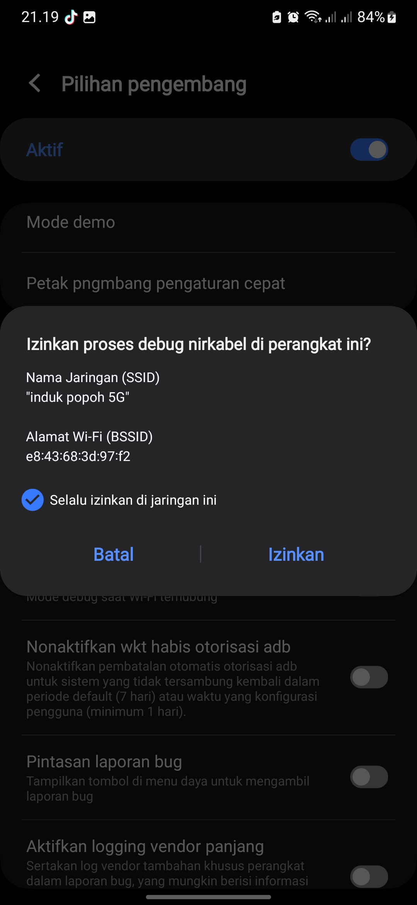
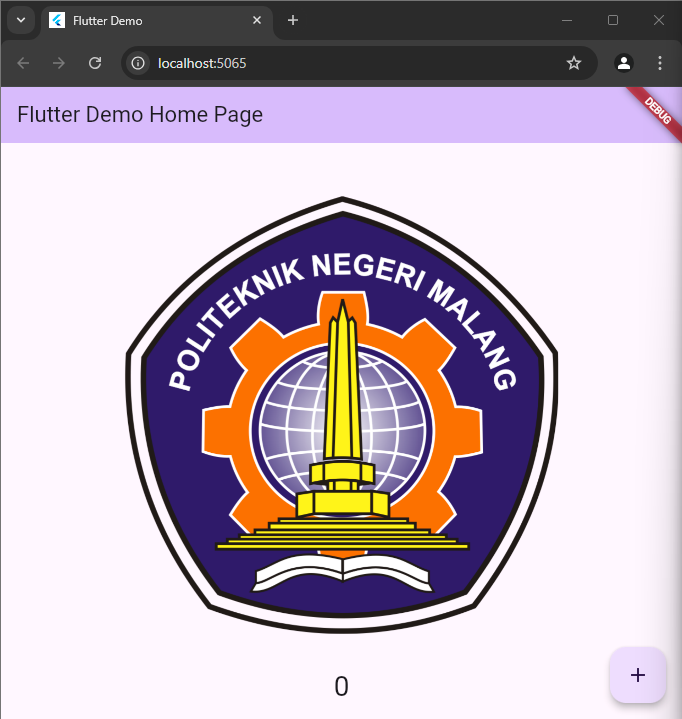

# Praktikum 1: Membuat Project Flutter Baru

Selesaikan langkah-langkah praktikum berikut ini menggunakan editor Visual Studio Code (VS Code), Android Studio, atau code editor lain kesukaan Anda.

## Langkah 1:
Buka VS Code, lalu tekan tombol `Ctrl + Shift + P`, maka akan tampil **Command Palette**. Ketik `Flutter`, kemudian pilih **New Application Project**.


## Langkah 2:
Buat folder sesuai style laporan praktikum yang Anda pilih. Disarankan menggunakan folder di dokumen, desktop, atau alamat folder lain yang tidak terlalu dalam atau panjang. Lalu pilih **Select a folder to create the project in**.


## Langkah 3:
Buat nama project Flutter `hello_world` seperti berikut, lalu tekan Enter. Tunggu hingga proses pembuatan project baru selesai.


**Perhatian:** Nama project ini harus huruf kecil semua (*lowercase*), tanpa menggunakan spasi. Untuk memisahkan kata, gunakan tanda underscore (_). Nama project tidak boleh diawali dengan angka atau karakter khusus lainnya. Nama project ini bukan nama aplikasi yang akan tampil di Play Store atau App Store. Untuk nama aplikasi, nanti dapat diatur saat deployment.

## Langkah 4:
Jika proses pembuatan project baru sudah selesai, pastikan tampilan seperti gambar berikut. Pesan akan muncul berupa **"Your Flutter Project is ready!"** yang menandakan bahwa Anda telah berhasil membuat project Flutter baru.


# Praktikum 2: Menghubungkan Perangkat Android atau Emulator (Cara Menghubungkan Perangkat Android)

## Sebelum Memulai
- Menonton video tutorial coding langsung (Opsional)
- Mengaktifkan proses debug USB
- Menjalankan aplikasi di perangkat Android menggunakan kabel
- Menjalankan aplikasi di perangkat Android menggunakan Wi-Fi
- Pemecahan masalah
- Kesimpulan

## 3. Mengaktifkan Proses Debug USB
Agar Android Studio dapat berkomunikasi dengan perangkat Android, Anda harus mengaktifkan proses debug USB di setelan **Opsi developer** di perangkat.

### Untuk menampilkan opsi developer dan mengaktifkan proses debug USB:
1. Di perangkat Android, ketuk **Settings** > **About phone**.
2. Ketuk **Build number** tujuh kali.
   - Jika diminta, masukkan sandi atau PIN perangkat.
   - Anda tahu bahwa Anda telah berhasil saat melihat pesan **"You are now a developer!"**.
   
   

3. Kembali ke **Settings**, lalu ketuk **System** > **Developer options**.
   - Jika Anda tidak melihat **Developer options**, ketuk **Advanced options**.

   

4. Ketuk **Developer options**, lalu aktifkan **USB debugging**.

   

## Menginstal Driver USB Google (khusus Windows)
Jika Android Studio diinstal di Windows, Anda harus menginstal driver perangkat USB agar dapat menjalankan aplikasi di perangkat fisik.

### Langkah-langkah:
1. Di Android Studio, klik **Tools** > **SDK Manager**.
   - Dialog **Preferences** > **Appearance & Behavior** > **System Settings** > **Android SDK** akan terbuka.
   
2. Klik tab **SDK Tools**.
3. Pilih **Google USB Driver**, lalu klik **OK**.

   

4. Setelah selesai, file driver akan didownload ke direktori `android_sdk\extras\google\usb_driver`.
5. Sekarang Anda dapat menghubungkan dan menjalankan aplikasi dari Android Studio.

---

### Catatan:
- Untuk Ubuntu Linux, ikuti petunjuk dalam "Menjalankan Aplikasi di Perangkat Hardware".

## 4. Menjalankan Aplikasi di Perangkat Android Menggunakan Kabel
Ada dua cara untuk menghubungkan perangkat ke Android Studio: melalui kabel atau Wi-Fi. Anda dapat memilih cara mana pun yang Anda sukai.

### Langkah-langkah Menjalankan Aplikasi di Perangkat Android:
1. **Sambungkan perangkat Android** ke komputer menggunakan kabel USB.
   - Dialog yang meminta Anda untuk mengizinkan proses debug USB akan muncul di perangkat.
   
   

2. Centang kotak **Always allow from this computer**, lalu ketuk **OK**.

3. Di Android Studio pada komputer, pastikan perangkat Anda dipilih di menu drop-down. Klik ikon **Run** di Android Studio.

   

4. Pilih perangkat, lalu klik **OK**. Android Studio akan menginstal aplikasi di perangkat, lalu menjalankannya.

### Catatan:
- Untuk Android Studio 3.6 dan versi yang lebih baru, perangkat fisik akan otomatis dipilih saat terhubung dengan proses debug yang aktif.
- Jika perangkat menjalankan platform Android yang belum diinstal di Android Studio dan muncul pesan berisi pertanyaan apakah Anda ingin menginstal platform yang diperlukan, klik **Install > Continue > Finish**. Android Studio akan menginstal aplikasi di perangkat, lalu menjalankannya.

## Menjalankan Aplikasi di Perangkat Android Menggunakan Wi-Fi

Jika tidak memiliki kabel, Anda juga dapat menghubungkan dan menjalankan aplikasi di perangkat dengan Wi-Fi.

### Memulai
- Pastikan komputer dan perangkat Anda terhubung ke jaringan nirkabel yang sama.
- Pastikan perangkat Anda menjalankan **Android 11** atau yang lebih baru. Untuk informasi selengkapnya, lihat [Memeriksa & mengupdate versi Android](https://support.google.com/android/answer/7680439).
- Pastikan komputer Anda telah memiliki **Android Studio versi terbaru**. Untuk mendownloadnya, lihat [Android Studio](https://developer.android.com/studio).
- Pastikan komputer Anda memiliki **SDK Platform Tools** versi terbaru.

### Menyambungkan Perangkat Anda
1. Di Android Studio, pilih **Pair Devices Using Wi-Fi** dari menu drop-down konfigurasi **Run**.
   
   

   Dialog **Pair devices over Wi-Fi** akan terbuka.

   

2. Buka **Developer options** di perangkat Android, scroll ke bawah ke bagian **Debugging**, lalu aktifkan **Wireless debugging**.

   

3. Pada pop-up **Izinkan proses debug nirkabel di jaringan ini?**, pilih **Allow**.

   

4. Jika Anda ingin menyambungkan perangkat dengan **kode QR**, pilih **Pair device with QR code**, lalu pindai kode QR di komputer Anda. Jika Anda ingin menyambungkan perangkat dengan **kode penghubung**, pilih **Pair device with pairing code**, lalu masukkan 6 digit kode.

5. Klik **Run**, dan Anda dapat men-*deploy* aplikasi ke perangkat Anda.

### Catatan:
Jika Anda ingin menyambungkan perangkat yang berbeda atau melupakan perangkat ini di komputer, buka **Wireless debugging** di perangkat, ketuk nama workstation Anda di bagian **Paired devices**, lalu pilih **Forget**.

# Praktikum 3: Membuat Repository GitHub dan Laporan Praktikum

## Langkah-langkah:

### Langkah 1:
Login ke akun GitHub Anda, lalu buat repository baru dengan nama **"flutter-fundamental-part1"**. Ini adalah langkah awal yang sangat penting, tetap semangat!

### Langkah 2:
Klik tombol **"Create repository"**. Sukses! Lanjut ke langkah berikutnya.

### Langkah 3:
Kembali ke VS Code, buka project Flutter `hello_world`, lalu buka terminal dengan cara:
- Pilih **Terminal > New Terminal** pada menu di atas.
- Ketik perintah berikut untuk menginisialisasi Git pada project:
```bash
  git init
```
## Langkah 4:
Pilih menu **Source Control** di bagian kiri, lalu lakukan **stages (+)** pada file `.gitignore` untuk mengunggah file pertama ke repository GitHub.

## Langkah 5:
Beri pesan commit **"tambah gitignore"** lalu klik **Commit (✔)**.

## Langkah 6:
Lakukan **push** dengan klik bagian menu titik tiga (**...**) > **Push**.

## Langkah 7:
Di pojok kanan bawah, akan tampil seperti gambar berikut. Klik **"Add Remote"**.

## Langkah 8:
Salin tautan repository Anda dari browser ke bagian ini, lalu klik **Add remote**. Setelah berhasil, tulis remote name dengan **"origin"**.

## Langkah 9:
Lakukan hal yang sama pada file `README.md` mulai dari Langkah 4. Setelah berhasil melakukan **push**, masukkan username GitHub Anda dan password berupa **token** yang telah dibuat (pengganti password konvensional ketika Anda login di browser GitHub). Reload halaman repository GitHub Anda, maka akan tampil hasil push kedua file tersebut seperti gambar berikut.

> **Perhatian**: Personal access token GitHub dapat Anda buat melalui [link ini](https://github.com/settings/tokens/new) atau dapat membaca dokumentasi GitHub Token.

## Langkah 10:
Lakukan **push** juga untuk semua file lainnya dengan pilih **Stage All Changes**. Beri pesan commit **"project hello_world"**. Maka akan tampil di repository GitHub Anda seperti berikut.

## Langkah 11:
Kembali ke VS Code, ubah platform di pojok kanan bawah ke emulator atau device atau bisa juga menggunakan browser Chrome. Lalu coba jalankan project `hello_world` dengan menekan **F5** atau pilih **Run > Start Debugging**. Tunggu proses kompilasi hingga selesai, maka aplikasi Flutter pertama Anda akan tampil seperti berikut.


> **Perhatian**: Proses Run atau kompilasi untuk pertama kali akan memakan waktu cukup lama (3-5 menit). Namun, proses kompilasi berikutnya menjadi lebih cepat. Berbeda ketika melakukan kompilasi ke device, hal ini akan memakan waktu lebih lama lagi.

---

## Langkah 12:
Silakan ambil **screenshot** seperti pada Langkah 11, namun teks yang ditampilkan dalam aplikasi berupa nama lengkap Anda. Simpan file screenshot dengan nama **01.png** pada folder `images` (buat folder baru jika belum ada) di project `hello_world` Anda. Lalu ubah isi `README.md` seperti berikut, sehingga tampil hasil screenshot pada file `README.md`. Kemudian **push** ke repository Anda.


> **Perhatian**: Lakukan proses screenshot seperti pada Langkah 12 untuk setiap Laporan Praktikum yang Anda akan buat pada praktikum selanjutnya hingga pertemuan project final.

# Praktikum 4: Menerapkan Widget Dasar

Selesaikan langkah-langkah praktikum berikut ini dengan melanjutkan dari praktikum sebelumnya.

## Langkah 1: Text Widget
1. Buat folder baru `basic_widgets` di dalam folder `lib`.
2. Kemudian buat file baru di dalam `basic_widgets` dengan nama `text_widget.dart`.
3. Ketik atau salin kode program berikut ke project `hello_world` Anda pada file `text_widget.dart`.

```dart
   import 'package:flutter/material.dart';

   class MyTextWidget extends StatelessWidget {
     const MyTextWidget({Key? key}) : super(key: key);

     @override
     Widget build(BuildContext context) {
       return const Text(
         "Nama saya Fulan, sedang belajar Pemrograman Mobile",
         style: TextStyle(color: Colors.red, fontSize: 14),
         textAlign: TextAlign.center,
       );
     }
   }
```
Perhatian: Gantilah teks Fulan dengan nama lengkap Anda.

Lakukan import file text_widget.dart ke main.dart, lalu ganti bagian text widget dengan kode di atas. Maka hasilnya seperti gambar berikut. Screenshot hasil milik Anda, lalu dibuat laporan pada file README.md.


Langkah 2: Image Widget
Buat sebuah file image_widget.dart di dalam folder basic_widgets dengan isi kode berikut.

```dart
import 'package:flutter/material.dart';

class MyImageWidget extends StatelessWidget {
  const MyImageWidget({Key? key}) : super(key: key);

  @override
  Widget build(BuildContext context) {
    return const Image(
      image: AssetImage("logo_polinema.jpg")
    );
  }
}
```

Lakukan penyesuaian asset pada file pubspec.yaml dan tambahkan file logo Anda di folder assets project hello_world.
```dart
flutter:
  assets:
    - logo_polinema.jpg
```

Jangan lupa sesuaikan kode dan import di file main.dart kemudian akan tampil gambar seperti berikut.



# Praktikum 5: Menerapkan Widget Material Design dan iOS Cupertino

Selesaikan langkah-langkah praktikum berikut ini dengan melanjutkan project hello_world Anda. Lakukan langkah yang sama seperti pada Praktikum 3, yaitu setiap widget dibuat file sendiri lalu import ke main.dart dan screenshot hasilnya.

## Langkah 1: Cupertino Button dan Loading Bar
Buat file di basic_widgets > loading_cupertino.dart. Import stateless widget dari material dan cupertino. Lalu isi kode di dalam method Widget build adalah sebagai berikut.

```dart
import 'package:flutter/cupertino.dart';
import 'package:flutter/material.dart';

class LoadingCupertino extends StatelessWidget {
  const LoadingCupertino({super.key});

  @override
  Widget build(BuildContext context) {
    return MaterialApp(
      home: Container(
        margin: const EdgeInsets.only(top: 30),
        color: Colors.white,
        child: Column(
          children: <Widget>[
            CupertinoButton(
              child: const Text("Contoh button"),
              onPressed: () {},
            ),
            const CupertinoActivityIndicator(),
          ],
        ),
      ),
    );
  }
}
```

## Langkah 2: Floating Action Button (FAB)
Button widget terdapat beberapa macam pada flutter yaitu ButtonBar, DropdownButton, TextButton, FloatingActionButton, IconButton, OutlineButton, PopupMenuButton, dan ElevatedButton.

Buat file di basic_widgets > fab_widget.dart. Import stateless widget dari material. Lalu isi kode di dalam method Widget build adalah sebagai berikut.

```dart
import 'package:flutter/material.dart';

class FabWidget extends StatelessWidget {
  const FabWidget({super.key});

  @override
  Widget build(BuildContext context) {
    return MaterialApp(
      home: Scaffold(
        floatingActionButton: FloatingActionButton(
          onPressed: () {
            // Tambahkan aksi yang diinginkan di sini
          },
          backgroundColor: Colors.pink,
          child: const Icon(Icons.thumb_up),
        ),
      ),
    );
  }
}
```

## Langkah 3: Scaffold Widget
Scaffold widget digunakan untuk mengatur tata letak sesuai dengan material design.

Ubah isi kode main.dart seperti berikut.

```dart
import 'package:flutter/material.dart';

void main() {
  runApp(const MyApp());
}

class MyApp extends StatelessWidget {
  const MyApp({Key? key}) : super(key: key);

  // This widget is the root of your application.
  @override
  Widget build(BuildContext context) {
    return MaterialApp(
      title: 'Flutter Demo',
      theme: ThemeData(
        primarySwatch: Colors.red,
      ),
      home: const MyHomePage(title: 'My Increment App'),
    );
  }
}

class MyHomePage extends StatefulWidget {
  const MyHomePage({Key? key, required this.title}) : super(key: key);

  final String title;

  @override
  State<MyHomePage> createState() => _MyHomePageState();
}

class _MyHomePageState extends State<MyHomePage> {
  int _counter = 0;

  void _incrementCounter() {
    setState(() {
      _counter++;
    });
  }

  @override
  Widget build(BuildContext context) {
    return Scaffold(
      appBar: AppBar(
        title: Text(widget.title),
      ),
      body: Center(
        child: Column(
          mainAxisAlignment: MainAxisAlignment.center,
          children: <Widget>[
            const Text(
              'You have pushed the button this many times:',
            ),
            Text(
              '$_counter',
              style: Theme.of(context).textTheme.headline4,
            ),
          ],
        ),
      ),
      bottomNavigationBar: BottomAppBar(
        child: Container(
          height: 50.0,
        ),
      ),
      floatingActionButton: FloatingActionButton(
        onPressed: _incrementCounter,
        tooltip: 'Increment Counter',
        child: const Icon(Icons.add),
      ), 
      floatingActionButtonLocation: FloatingActionButtonLocation.centerDocked,
    );
  }
}
```

## Langkah 4: Dialog Widget
Dialog widget pada flutter memiliki dua jenis dialog yaitu AlertDialog dan SimpleDialog.

Ubah isi kode main.dart seperti berikut.
```dart
class MyApp extends StatelessWidget {
  const MyApp({Key? key}) : super(key: key);

  @override
  Widget build(BuildContext context) {
    return const MaterialApp(
      home: Scaffold(
        body: MyLayout(),
      ),
    );
  }
}

class MyLayout extends StatelessWidget {
  const MyLayout({Key? key}) : super(key: key);

  @override
  Widget build(BuildContext context) {
    return Padding(
      padding: const EdgeInsets.all(8.0),
      child: ElevatedButton(
        child: const Text('Show alert'),
        onPressed: () {
          showAlertDialog(context);
        },
      ),
    );
  }
}

showAlertDialog(BuildContext context) {
  // set up the button
  Widget okButton = TextButton(
    child: const Text("OK"),
    onPressed: () {
      Navigator.pop(context);
    },
  );

  // set up the AlertDialog
  AlertDialog alert = AlertDialog(
    title: const Text("My title"),
    content: const Text("This is my message."),
    actions: [
      okButton,
    ],
  );

  // show the dialog
  showDialog(
    context: context,
    builder: (BuildContext context) {
      return alert;
    },
  );
}
```

## Langkah 5: Input dan Selection Widget
Flutter menyediakan widget yang dapat menerima input dari pengguna aplikasi yaitu antara lain Checkbox, Date and Time Pickers, Radio Button, Slider, Switch, TextField.

Contoh penggunaan TextField widget adalah sebagai berikut:
```dart
import 'package:flutter/material.dart';

class TextFieldWidget extends StatelessWidget {
  const TextFieldWidget({super.key});

  @override
  Widget build(BuildContext context) {
    return MaterialApp(
      home: Scaffold(
        appBar: AppBar(
          title: const Text("Contoh TextField"),
        ),
        body: const Padding(
          padding: EdgeInsets.all(8.0),
          child: TextField(
            decoration: InputDecoration(
              border: OutlineInputBorder(),
              labelText: 'Nama',
            ),
          ),
        ),
      ),
    );
  }
}
```

## Langkah 6: Date and Time Pickers
Date and Time Pickers termasuk pada kategori input dan selection widget, berikut adalah contoh penggunaan Date and Time Pickers.

```dart
import 'package:flutter/material.dart';
import 'dart:async';

class DateTimePicker extends StatefulWidget {
  const DateTimePicker({super.key});

  @override
  _DateTimePickerState createState() => _DateTimePickerState();
}

class _DateTimePickerState extends State<DateTimePicker> {
  DateTime selectedDate = DateTime.now();

  Future<void> _selectDate(BuildContext context) async {
    final DateTime? picked = await showDatePicker(
      context: context,
      initialDate: selectedDate,
      firstDate: DateTime(2015, 8),
      lastDate: DateTime(2101),
    );
    if (picked != null && picked != selectedDate) {
      setState(() {
        selectedDate = picked;
      });
    }
  }

  @override
  Widget build(BuildContext context) {
    return Scaffold(
      appBar: AppBar(
        title: const Text('Contoh Date Picker'),
      ),
      body: Center(
        child: Column(
          mainAxisSize: MainAxisSize.min,
          children: <Widget>[
            Text("${selectedDate.toLocal()}".split(' ')[0]),
            const SizedBox(height: 20.0),
            ElevatedButton(
              onPressed: () => _selectDate(context),
              child: const Text('Pilih Tanggal'),
            ),
          ],
        ),
      ),
    );
  }
}
```