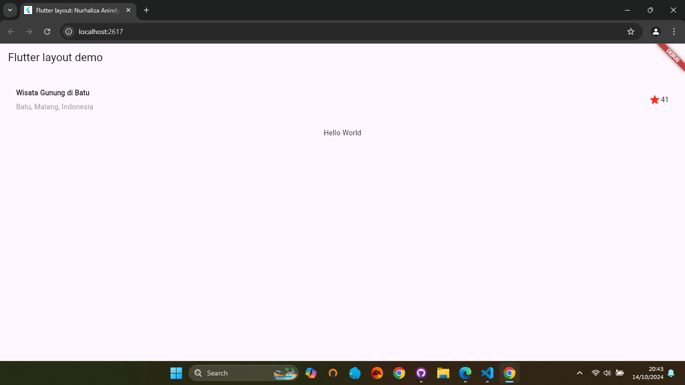
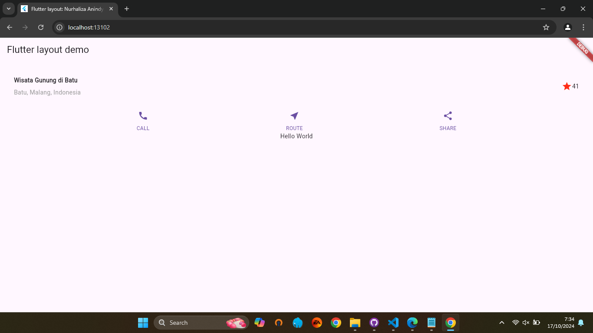
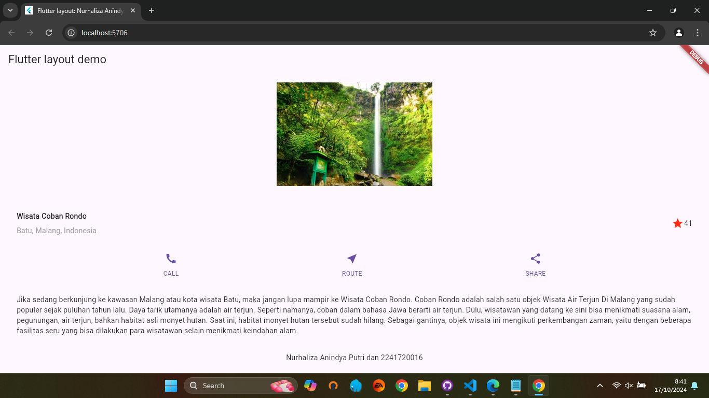

# Layout dan Navigasi
## Praktikum 1: Membangun Layout di Flutter

### Langkah 1: Buat Project Baru
Buatlah sebuah project flutter baru dengan nama `layout_flutter`. Atau sesuaikan style laporan praktikum yang Anda buat.

### Langkah 2: Buka file `lib/main.dart`
Buka file `main.dart` lalu ganti dengan kode berikut. Isi nama dan NIM Anda di text title.

```dart
  import 'package:flutter/material.dart';

void main() => runApp(const MyApp());

class MyApp extends StatelessWidget {
  const MyApp({super.key});

  @override
  Widget build(BuildContext context) {
    return MaterialApp(
      title: 'Flutter layout: Nama dan NIM Anda',
      home: Scaffold(
        appBar: AppBar(
          title: const Text('Flutter layout demo'),
        ),
        body: const Center(
          child: Text('Hello World'),
        ),
      ),
    );
  }
```
### Langkah 3: Identifikasi layout diagram
Langkah pertama adalah memecah tata letak menjadi elemen dasarnya:

  - Identifikasi baris dan kolom.
  - Apakah tata letaknya menyertakan kisi-kisi (grid)?
  - Apakah ada elemen yang tumpang tindih?
  - Apakah UI memerlukan tab?
  - Perhatikan area yang memerlukan alignment, padding, atau borders.
Pertama, identifikasi elemen yang lebih besar. Dalam contoh ini, empat elemen disusun menjadi sebuah kolom: sebuah gambar, dua baris, dan satu blok teks.

Selanjutnya, buat diagram setiap baris. Baris pertama, disebut bagian Judul, memiliki 3 anak: kolom teks, ikon bintang, dan angka. Anak pertamanya, kolom, berisi 2 baris teks. Kolom pertama itu memakan banyak ruang, sehingga harus dibungkus dengan widget yang Diperluas.

Baris kedua, disebut bagian Tombol, juga memiliki 3 anak: setiap anak merupakan kolom yang berisi ikon dan teks.

Setelah tata letak telah dibuat diagramnya, cara termudah adalah dengan menerapkan pendekatan bottom-up. Untuk meminimalkan kebingungan visual dari kode tata letak yang banyak bertumpuk, tempatkan beberapa implementasi dalam variabel dan fungsi.

### Langkah 4: Implementasi title row
Pertama, Anda akan membuat kolom bagian kiri pada judul. Tambahkan kode berikut di bagian atas metode build() di dalam kelas MyApp:

```dart
import 'package:flutter/material.dart';

void main() => runApp(const MyApp());

class MyApp extends StatelessWidget {
  const MyApp({super.key});

  @override
  Widget build(BuildContext context) {
    Widget titleSection = Container(
      padding: const EdgeInsets.all(32),
      child: Row(
        children: [
          Expanded(
            // Soal 1: Letakkan Column di dalam Expanded
            child: Column(
              crossAxisAlignment: CrossAxisAlignment.start, 
              children: [
                // Soal 2: Baris pertama teks di dalam Container
                Container(
                  padding: const EdgeInsets.only(bottom: 8), 
                  child: const Text(
                    'Wisata Gunung di Batu',
                    style: TextStyle(
                      fontWeight: FontWeight.bold,
                    ),
                  ),
                ),
                Text(
                  'Batu, Malang, Indonesia',
                  style: TextStyle(color: Colors.grey), 
                ),
              ],
            ),
          ),
          // Soal 3: Ikon bintang dan teks "41"
          Icon(
            Icons.star,
            color: Colors.red,
          ),
          const Text('41'),
        ],
      ),
    );

    return MaterialApp(
      title: 'Flutter layout: Nurhaliza Anindya Putri dan 2241720016',
      home: Scaffold(
        appBar: AppBar(
          title: const Text('Flutter layout demo'),
        ),
        body: Column(
          children: [
            titleSection,
            const Center(
              child: Text('Hello World'), 
            ),
          ],
        ),
      ),
    );
  }
}
```

### Hasil running


## Praktikum 2: Implementasi button row
### Langkah 1: Buat method Column _buildButtonColumn
Bagian tombol berisi 3 kolom yang menggunakan tata letak yang sama—sebuah ikon di atas baris teks. Kolom pada baris ini diberi jarak yang sama, dan teks serta ikon diberi warna primer.

Karena kode untuk membangun setiap kolom hampir sama, buatlah metode pembantu pribadi bernama buildButtonColumn(), yang mempunyai parameter warna, Icon dan Text, sehingga dapat mengembalikan kolom dengan widgetnya sesuai dengan warna tertentu.

lib/main.dart (_buildButtonColumn)

```dart
import 'package:flutter/material.dart';

void main() => runApp(const MyApp());

class MyApp extends StatelessWidget {
  const MyApp({super.key});

  @override
  Widget build(BuildContext context) {
    Widget titleSection = Container(
      padding: const EdgeInsets.all(32),
      child: Row(
        children: [
          Expanded(
            child: Column(
              crossAxisAlignment: CrossAxisAlignment.start,
              children: [
                Container(
                  padding: const EdgeInsets.only(bottom: 8),
                  child: const Text(
                    'Wisata Gunung di Batu',
                    style: TextStyle(
                      fontWeight: FontWeight.bold,
                    ),
                  ),
                ),
                const Text(
                  'Batu, Malang, Indonesia',
                  style: TextStyle(
                    color: Colors.grey,
                  ),
                ),
              ],
            ),
          ),
          const Icon(
            Icons.star,
            color: Colors.red,
          ),
          const Text('41'),
        ],
      ),
    );

    // Langkah 1
    Column buildButtonColumn(Color color, IconData icon, String label) {
      return Column(
        mainAxisSize: MainAxisSize.min,
        mainAxisAlignment: MainAxisAlignment.center,
        children: [
          Icon(icon, color: color),
          Container(
            margin: const EdgeInsets.only(top: 8),
            child: Text(
              label,
              style: TextStyle(
                fontSize: 12,
                fontWeight: FontWeight.w400,
                color: color,
              ),
            ),
          ),
        ],
      );
    }
```

### Langkah 2: Buat widget buttonSection
Buat Fungsi untuk menambahkan ikon langsung ke kolom. Teks berada di dalam Container dengan margin hanya di bagian atas, yang memisahkan teks dari ikon.

Bangun baris yang berisi kolom-kolom ini dengan memanggil fungsi dan set warna, Icon, dan teks khusus melalui parameter ke kolom tersebut. Sejajarkan kolom di sepanjang sumbu utama menggunakan MainAxisAlignment.spaceEvenly untuk mengatur ruang kosong secara merata sebelum, di antara, dan setelah setiap kolom. Tambahkan kode berikut tepat di bawah deklarasi titleSection di dalam metode build():

lib/main.dart (buttonSection)
```dart

    // Langkah 2
    Color color = Theme.of(context).primaryColor;
    Widget buttonSection = Row(
      mainAxisAlignment: MainAxisAlignment.spaceEvenly,
      children: [
        buildButtonColumn(color, Icons.call, 'CALL'),
        buildButtonColumn(color, Icons.near_me, 'ROUTE'),
        buildButtonColumn(color, Icons.share, 'SHARE'),
      ],
    );
```

### Langkah 3: Tambah button section ke body
Tambahkan variabel buttonSection ke dalam body seperti berikut:
```dart
    return MaterialApp(
      title: 'Flutter layout: Nurhaliza Anindya Putri dan 2241720016',
      home: Scaffold(
        appBar: AppBar(
          title: const Text('Flutter layout demo'),
        ),
        body: Column(
          children: [
            titleSection,
            buttonSection,
            const Center(
              child: Text('Hello World'),
            ),
          ],
        ),
      ),
    );
  }
}
```

### Hasil running



## Praktikum 3: Implementasi text section
### Langkah 1: Buat widget textSection
Tentukan bagian teks sebagai variabel. Masukkan teks ke dalam Container dan tambahkan padding di sepanjang setiap tepinya. Tambahkan kode berikut tepat di bawah deklarasi buttonSection:

```dart
import 'package:flutter/material.dart';

void main() => runApp(const MyApp());

class MyApp extends StatelessWidget {
  const MyApp({super.key});

  @override
  Widget build(BuildContext context) {
    Widget imageSection = Container(
      padding: const EdgeInsets.all(16.0),
      child: SizedBox(
        width: 300,
        height: 200,
        child: Image.asset(
          'assets/images/foto_wisata.jpg', 
          fit: BoxFit.cover, 
        ),
      ),
    );

    Widget titleSection = Container(
      padding: const EdgeInsets.all(32),
      child: Row(
        children: [
          Expanded(
            child: Column(
              crossAxisAlignment: CrossAxisAlignment.start,
              children: [
                Container(
                  padding: const EdgeInsets.only(bottom: 8),
                  child: const Text(
                    'Wisata Coban Rondo',
                    style: TextStyle(
                      fontWeight: FontWeight.bold,
                    ),
                  ),
                ),
                const Text(
                  'Batu, Malang, Indonesia',
                  style: TextStyle(
                    color: Colors.grey,
                  ),
                ),
              ],
            ),
          ),
          const Icon(
            Icons.star,
            color: Colors.red,
          ),
          const Text('41'),
        ],
      ),
    );

    // Langkah 1
    Column buildButtonColumn(Color color, IconData icon, String label) {
      return Column(
        mainAxisSize: MainAxisSize.min,
        mainAxisAlignment: MainAxisAlignment.center,
        children: [
          Icon(icon, color: color),
          Container(
            margin: const EdgeInsets.only(top: 8),
            child: Text(
              label,
              style: TextStyle(
                fontSize: 12,
                fontWeight: FontWeight.w400,
                color: color,
              ),
            ),
          ),
        ],
      );
    }

    // Langkah 2
    Color color = Theme.of(context).primaryColor;
    Widget buttonSection = Row(
      mainAxisAlignment: MainAxisAlignment.spaceEvenly,
      children: [
        buildButtonColumn(color, Icons.call, 'CALL'),
        buildButtonColumn(color, Icons.near_me, 'ROUTE'),
        buildButtonColumn(color, Icons.share, 'SHARE'),
      ],
    );

    // Langkah 3
    Widget textSection = Container(
      padding: const EdgeInsets.all(32),
      child: const Text(
        'Jika sedang berkunjung ke kawasan Malang atau kota wisata Batu,' 
        ' maka jangan lupa mampir ke Wisata Coban Rondo. Coban Rondo adalah salah'
        ' satu objek Wisata Air Terjun Di Malang yang sudah populer sejak puluhan tahun lalu.'
        ' Daya tarik utamanya adalah air terjun. Seperti namanya, coban dalam bahasa Jawa berarti'
        ' air terjun. Dulu, wisatawan yang datang ke sini bisa menikmati suasana alam, pegunungan, air terjun,' 
        ' bahkan habitat asli monyet hutan. Saat ini, habitat monyet hutan tersebut sudah hilang. Sebagai gantinya,'
        ' objek wisata ini mengikuti perkembangan zaman, yaitu dengan beberapa fasilitas seru yang bisa dilakukan para'
        ' wisatawan selain menikmati keindahan alam.',
        softWrap: true,
      ),
    );
```

Dengan memberi nilai softWrap = true, baris teks akan memenuhi lebar kolom sebelum membungkusnya pada batas kata.

### Langkah 2: Tambahkan variabel text section ke body
Tambahkan widget variabel textSection ke dalam body seperti berikut:

```dart 

    return MaterialApp(
      title: 'Flutter layout: Nurhaliza Anindya Putri dan 2241720016',
      home: Scaffold(
        appBar: AppBar(
          title: const Text('Flutter layout demo'),
        ),
        body: Column(
          children: [
            imageSection,
            titleSection,   
            buttonSection,
            textSection,   
            const Center(
              child: Text('Nurhaliza Anindya Putri dan 2241720016'),
            ),
          ],
        ),
      ),
    );
  }
}
```

### Hasil running


## Praktikum 4: Implementasi image section
### Langkah 1: Siapkan aset gambar
Anda dapat mencari gambar di internet yang ingin ditampilkan. Buatlah folder images di root project layout_flutter. Masukkan file gambar tersebut ke folder images, lalu set nama file tersebut ke file pubspec.yaml seperti berikut:

### Langkah 2: Tambahkan gambar ke body
Tambahkan aset gambar ke dalam body seperti berikut:

```dart
    return MaterialApp(
      title: 'Flutter layout: Nurhaliza Anindya Putri dan 2241720016',
      home: Scaffold(
        appBar: AppBar(
          title: const Text('Flutter layout demo'),
        ),
        body: Column( 
          children: [
            Image.asset(
              'images/foto_wisata.jpg',
              width: 600,
              height: 240,
              fit: BoxFit.cover,
            ),
            titleSection,
            buttonSection,
            textSection,
            const Center(
              child: Text('Nurhaliza Anindya Putri dan 2241720016'),
            ),
          ],
        ),
      ),
    );
  }
}
```

BoxFit.cover memberi tahu kerangka kerja bahwa gambar harus sekecil mungkin tetapi menutupi seluruh kotak rendernya.

### Langkah 3: Terakhir, ubah menjadi ListView
Pada langkah terakhir ini, atur semua elemen dalam ListView, bukan Column, karena ListView mendukung scroll yang dinamis saat aplikasi dijalankan pada perangkat yang resolusinya lebih kecil.

```dart
        body: ListView( 
          children: [
            Image.asset(
              'images/foto_wisata.jpg',
              width: 600,
              height: 240,
              fit: BoxFit.cover,
            ),
            titleSection,
            buttonSection,
            textSection,
            const Center(
              child: Text('Nurhaliza Anindya Putri dan 2241720016'),
            ),
          ],
        ),
      ),
    );
  }
}
```
- tambahan kode program pada file pubspec.yaml

```dart
name: layout_flutter
description: "A new Flutter project."
publish_to: 'none' 

version: 1.0.0+1

environment:
  sdk: ^3.5.3

dependencies:
  flutter:
    sdk: flutter
  cupertino_icons: ^1.0.8

dev_dependencies:
  flutter_test:
    sdk: flutter
  flutter_lints: ^4.0.0

flutter:
  uses-material-design: true

  # Bagian assets sudah disertakan di sini, tidak perlu diulang
  assets:
    - assets/images/foto_wisata.jpg
```

### Hasil running

