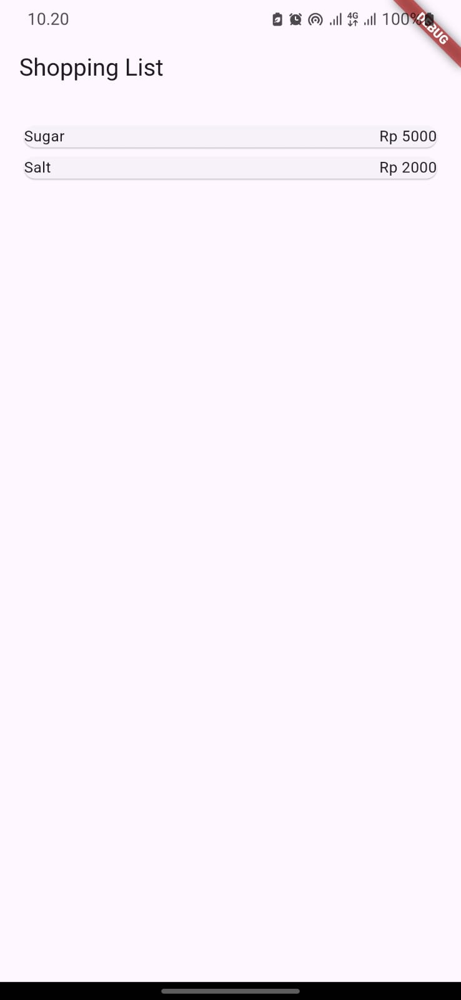
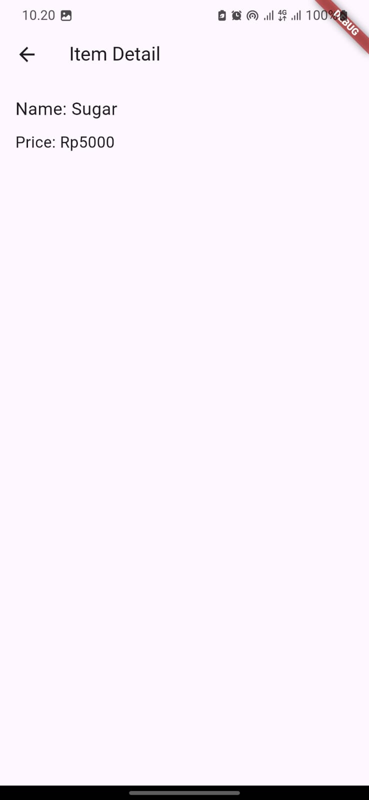
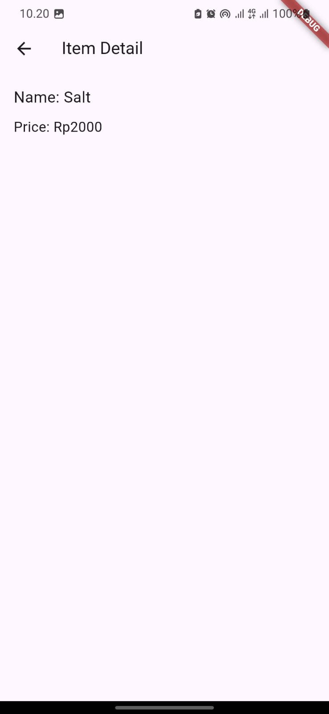
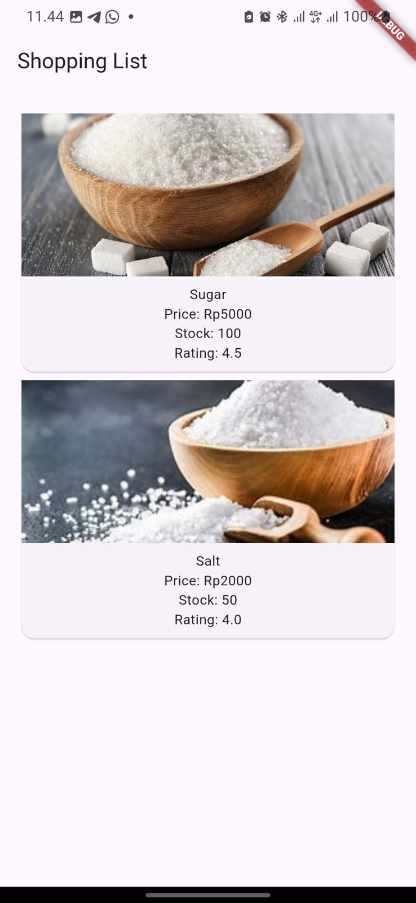
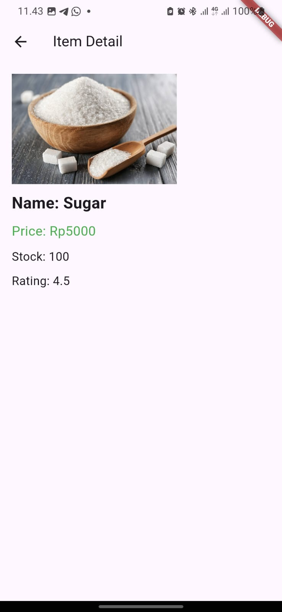
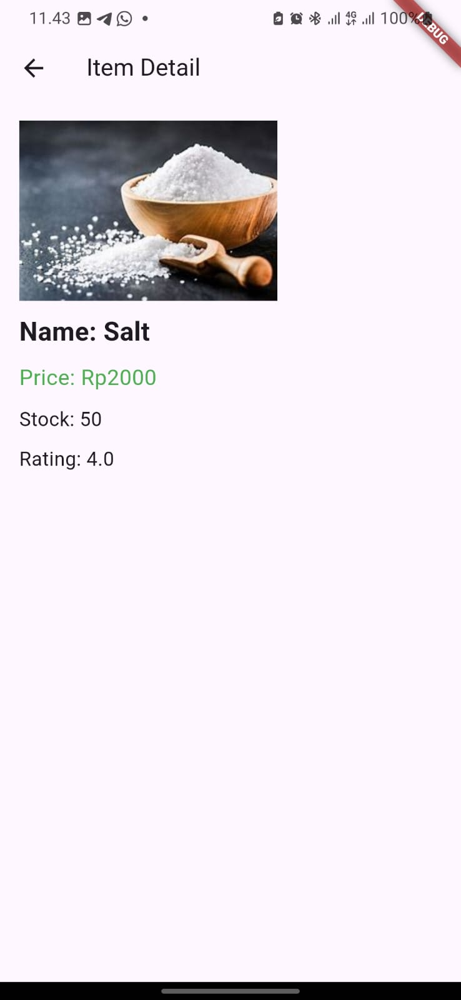

## Praktikum 5: Membangun Navigasi di Flutter
### Langkah 1: Siapkan project baru
Sebelum melanjutkan praktikum, buatlah sebuah project baru Flutter dengan nama belanja dan susunan folder seperti pada gambar berikut. Penyusunan ini dimaksudkan untuk mengorganisasi kode dan widget yang lebih mudah.

### Langkah 2: Mendefinisikan Route
Buatlah dua buah file dart dengan nama home_page.dart dan item_page.dart pada folder pages. Untuk masing-masing file, deklarasikan class HomePage pada file home_page.dart dan ItemPage pada item_page.dart. Turunkan class dari StatelessWidget. Gambaran potongan kode dapat anda lihat sebagai berikut.

```dart
import 'package:flutter/material.dart';
import 'package:belanja/model/item.dart';

class HomePage extends StatelessWidget {
  final List<Item> items = [
    Item(name: 'Sugar', price: 5000),
    Item(name: 'Salt', price: 2000),
  ];

  @override
  Widget build(BuildContext context) {
    return Scaffold(
      appBar: AppBar(
        title: Text('Shopping List'),
      ),
      body: Container(
        margin: EdgeInsets.all(8),
        child: ListView.builder(
          padding: EdgeInsets.all(8),
          itemCount: items.length,
          itemBuilder: (context, index) {
            final item = items[index];
            return Card(
              child: InkWell(
                onTap: () {
                  Navigator.pushNamed(
                    context,
                    '/item',
                    arguments: item, // Mengirim data item
                  );
                },
                child: Row(
                  children: [
                    Expanded(child: Text(item.name)),
                    Expanded(
                      child: Text(
                        'Rp ${item.price}',
                        textAlign: TextAlign.end,
                      ),
                    )
                  ],
                ),
              ),
            );
          },
        ),
      ),
    );
  }
}
```

### Langkah 3: Lengkapi Kode di main.dart
Setelah kedua halaman telah dibuat dan didefinisikan, bukalah file main.dart. Pada langkah ini anda akan mendefinisikan Route untuk kedua halaman tersebut. Definisi penamaan route harus bersifat unique. Halaman HomePage didefinisikan sebagai /. Dan halaman ItemPage didefinisikan sebagai /item. Untuk mendefinisikan halaman awal, anda dapat menggunakan named argument initialRoute. Gambaran tahapan ini, dapat anda lihat pada potongan kode berikut.

- Kode program HomePage
```dart
import 'package:flutter/material.dart';
import 'package:belanja/pages/home_page.dart';
import 'package:belanja/pages/item_page.dart';

void main() {
  runApp(MaterialApp(
    initialRoute: '/',
    routes: {
      '/': (context) => HomePage(),
      '/item': (context) => ItemPage(),
    },
  ));
}
```

- Kode program ItemPage
```dart
import 'package:flutter/material.dart';
import 'package:belanja/model/item.dart';

class ItemPage extends StatelessWidget {
  @override
  Widget build(BuildContext context) {
    final Item item = ModalRoute.of(context)!.settings.arguments as Item;

    return Scaffold(
      appBar: AppBar(
        title: Text('Item Detail'),
      ),
      body: Padding(
        padding: const EdgeInsets.all(16.0),
        child: Column(
          crossAxisAlignment: CrossAxisAlignment.start,
          children: [
            Text(
              'Name: ${item.name}',
              style: TextStyle(fontSize: 20),
            ),
            SizedBox(height: 10),
            Text(
              'Price: Rp${item.price}',
              style: TextStyle(fontSize: 18),
            ),
          ],
        ),
      ),
    );
  }
}
```

### Langkah 4: Membuat data model
Sebelum melakukan perpindahan halaman dari HomePage ke ItemPage, dibutuhkan proses pemodelan data. Pada desain mockup, dibutuhkan dua informasi yaitu nama dan harga. Untuk menangani hal ini, buatlah sebuah file dengan nama item.dart dan letakkan pada folder models. Pada file ini didefinisikan pemodelan data yang dibutuhkan. Ilustrasi kode yang dibutuhkan, dapat anda lihat pada potongan kode berikut.

```dart
class Item {
  final String name;
  final int price;

  Item({required this.name, required this.price});
}
```

### Langkah 5: Lengkapi kode di class HomePage
Pada halaman HomePage terdapat ListView widget. Sumber data ListView diambil dari model List dari object Item. Gambaran kode yang dibutuhkan untuk melakukan definisi model dapat anda lihat sebagai berikut.

```dart

```

### Langkah 6: Membuat ListView dan itemBuilder
Untuk menampilkan ListView pada praktikum ini digunakan itemBuilder. Data diambil dari definisi model yang telah dibuat sebelumnya. Untuk menunjukkan batas data satu dan berikutnya digunakan widget Card. Kode yang telah umum pada bagian ini tidak ditampilkan. Gambaran kode yang dibutuhkan dapat anda lihat sebagai berikut.

```dart
      body: Container(
        margin: EdgeInsets.all(8),
        child: ListView.builder(
          padding: EdgeInsets.all(8),
          itemCount: items.length,
          itemBuilder: (context, index) {
            final item = items[index];
            return Card(
              child: InkWell(
                onTap: () {
                  Navigator.pushNamed(
                    context,
                    '/item',
                    arguments: item, // Mengirim data item
                  );
                },
                child: Row(
                  children: [
                    Expanded(child: Text(item.name)),
                    Expanded(
                      child: Text(
                        'Rp ${item.price}',
                        textAlign: TextAlign.end,
                      ),
                    )
                  ],
                ),
              ),
            );
          },
        ),
```

Jalankan aplikasi pada emulator atau pada device anda.

Langkah 7: Menambahkan aksi pada ListView
Item pada ListView saat ini ketika ditekan masih belum memberikan aksi tertentu. Untuk menambahkan aksi pada ListView dapat digunakan widget InkWell atau GestureDetector. Perbedaan utamanya InkWell merupakan material widget yang memberikan efek ketika ditekan. Sedangkan GestureDetector bersifat umum dan bisa juga digunakan untuk gesture lain selain sentuhan. Pada praktikum ini akan digunakan widget InkWell.

Untuk menambahkan sentuhan, letakkan cursor pada widget pembuka Card. Kemudian gunakan shortcut quick fix dari VSCode (Ctrl + . pada Windows atau Cmd + . pada MacOS). Sorot menu wrap with widget... Ubah nilai widget menjadi InkWell serta tambahkan named argument onTap yang berisi fungsi untuk berpindah ke halaman ItemPage. Ilustrasi potongan kode dapat anda lihat pada potongan berikut.

```dart
return Card(
              child: InkWell(
                onTap: () {
                  Navigator.pushNamed(
                    context,
                    '/item',
                    arguments: item, // Mengirim data item
                  );
                },
```

Jalankan aplikasi kembali dan pastikan ListView dapat disentuh dan berpindah ke halaman berikutnya. Periksa kembali jika terdapat kesalahan.

### Hasil running




# Tugas Praktikum 2
1. Untuk melakukan pengiriman data ke halaman berikutnya, cukup menambahkan informasi arguments pada penggunaan Navigator. Perbarui kode pada bagian Navigator menjadi seperti berikut.

```dart
Navigator.pushNamed(context, '/item', arguments: item);
```

2. Pembacaan nilai yang dikirimkan pada halaman sebelumnya dapat dilakukan menggunakan ModalRoute. Tambahkan kode berikut pada blok fungsi build dalam halaman ItemPage. Setelah nilai didapatkan, anda dapat menggunakannya seperti penggunaan variabel pada umumnya. (https://docs.flutter.dev/cookbook/navigation/navigate-with-arguments)

```dart
final itemArgs = ModalRoute.of(context)!.settings.arguments as Item;
```

3. Pada hasil akhir dari aplikasi belanja yang telah anda selesaikan, tambahkan atribut foto produk, stok, dan rating. Ubahlah tampilan menjadi GridView seperti di aplikasi marketplace pada umumnya.

4. Silakan implementasikan Hero widget pada aplikasi belanja Anda dengan mempelajari dari sumber ini: https://docs.flutter.dev/cookbook/navigation/hero-animations

5. Sesuaikan dan modifikasi tampilan sehingga menjadi aplikasi yang menarik. Selain itu, specah widget menjadi kode yang lebih kecil. Tambahkan Nama dan NIM di footer aplikasi belanja Anda.

6. Selesaikan Praktikum 5: Navigasi dan Rute tersebut. Cobalah modifikasi menggunakan plugin go_router, lalu dokumentasikan dan push ke repository Anda berupa screenshot setiap hasil pekerjaan beserta penjelasannya di file README.md. Kumpulkan link commit repository GitHub Anda kepada dosen yang telah disepakati!

### Perubahan kode program untuk memenuhi tugas 2
- file main.dart
```dart
import 'package:flutter/material.dart';
import 'pages/home_page.dart';
import 'pages/item_page.dart';

void main() {
  runApp(MaterialApp(
    initialRoute: '/',
    routes: {
      '/': (context) => HomePage(),
      // ignore: prefer_const_constructors
      '/item': (context) => ItemPage(),
    },
  ));
}
```

- file home_page.dart
```dart
import 'package:flutter/material.dart';
import 'package:belanja/model/item.dart';
import 'package:belanja/widgets/item_card.dart';

// ignore: use_key_in_widget_constructors
class HomePage extends StatelessWidget {
  final List<Item> items = [
    Item(
      name: 'Sugar',
      price: 5000,
      imageUrl: 'assets/img/gula.jpg',
      stock: 100,
      rating: 4.5,
    ),
    Item(
      name: 'Salt',
      price: 2000,
      imageUrl: 'assets/img/garam.jpg', 
      stock: 50,
      rating: 4.0,
    ),
  ];

  @override
  Widget build(BuildContext context) {
    return Scaffold(
      appBar: AppBar(
        title: const Text('Shopping List'),
      ),
      body: Container(
        margin: const EdgeInsets.all(8),
        child: ListView.builder(
          padding: const EdgeInsets.all(8),
          itemCount: items.length,
          itemBuilder: (context, index) {
            final item = items[index];
            return ItemCard(item: item);
          },
        ),
      ),
    );
  }
}
```

- file item_page.dart
```dart
import 'package:flutter/material.dart';
import 'package:belanja/model/item.dart';

class ItemPage extends StatelessWidget {
  const ItemPage({super.key});

  @override
  Widget build(BuildContext context) {
    final Item item = ModalRoute.of(context)!.settings.arguments as Item;

    return Scaffold(
      appBar: AppBar(
        title: const Text('Item Detail'),
      ),
      body: Padding(
        padding: const EdgeInsets.all(16.0),
        child: Column(
          crossAxisAlignment: CrossAxisAlignment.start,
          children: [
            Hero(
              tag: item.name, 
              child: Image.asset(
                item.imageUrl,
                height: 150,
                fit: BoxFit.cover,
              ),
            ),
            const SizedBox(height: 10),
            Text(
              'Name: ${item.name}',
              style: const TextStyle(fontSize: 24, fontWeight: FontWeight.bold),
            ),
            const SizedBox(height: 10),
            Text(
              'Price: Rp${item.price}',
              style: const TextStyle(fontSize: 20, color: Colors.green),
            ),
            const SizedBox(height: 10),
            Text(
              'Stock: ${item.stock}',
              style: const TextStyle(fontSize: 18),
            ),
            const SizedBox(height: 10),
            Text(
              'Rating: ${item.rating}',
              style: const TextStyle(fontSize: 18),
            ),
          ],
        ),
      ),
    );
  }
}
```

- file item.dart
```dart
class Item {
  final String name;
  final int price;
  final String imageUrl;
  final int stock; 
  final double rating; 

  Item({
    required this.name,
    required this.price,
    required this.imageUrl,
    required this.stock,
    required this.rating,
  });
}
```

- file item_card.dart
```dart
import 'package:flutter/material.dart';
import 'package:belanja/model/item.dart';

class ItemCard extends StatelessWidget {
  final Item item;

  const ItemCard({super.key, required this.item});

  @override
  Widget build(BuildContext context) {
    return GestureDetector(
      onTap: () {
        Navigator.pushNamed(
          context,
          '/item',
          arguments: item,
        );
      },
      child: Card(
        child: Column(
          children: [
            Container(
              height: 150,
              width: double.infinity, 
              child: Image.asset(
                item.imageUrl,
                fit: BoxFit.cover,
              ),
            ),
            Padding(
              padding: const EdgeInsets.all(8.0),
              child: Column(
                children: [
                  Text(item.name),
                  Text('Price: Rp${item.price}'),
                  Text('Stock: ${item.stock}'),
                  Text('Rating: ${item.rating}'),
                ],
              ),
            ),
          ],
        ),
      ),
    );
  }
}
```

- file footer.dart
```dart
import 'package:flutter/material.dart';

class Footer extends StatelessWidget {
  const Footer({super.key});

  @override
  Widget build(BuildContext context) {
    return Container(
      padding: const EdgeInsets.all(16.0),
      color: Colors.blueGrey[50],
      child: const Center(
        child: Text(
          'Nurhaliza Anindya Putri - NIM: 123456789',
          style: TextStyle(fontSize: 16),
        ),
      ),
    );
  }
}H
```

### Hasil running



